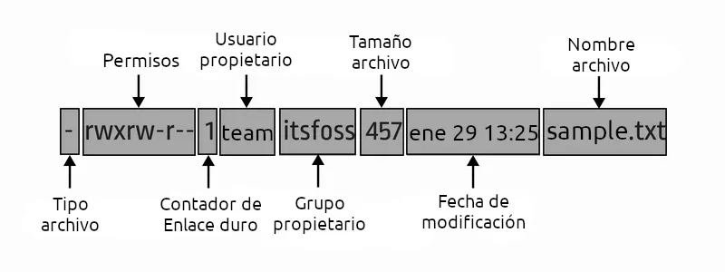
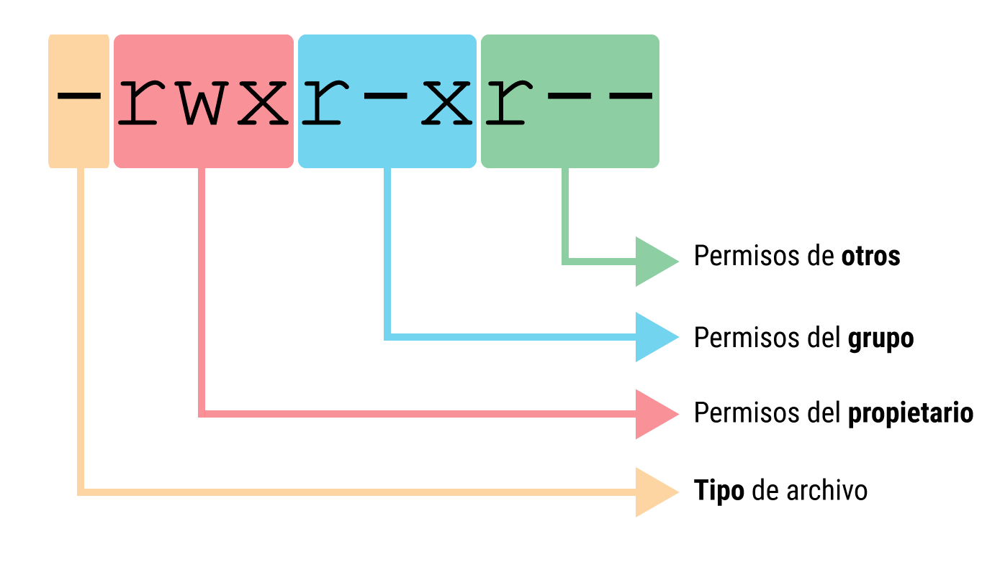

---
En este espacio exploraremos y aprenderemos sobre Bash, la shell más usada en sistemas basados en Unix. Aquí aprenderemos lo más básico de Bash, como comandos, conceptos básicos y fundamentales para manejar la terminal. Este lugar tiene una sola función: aprender y practicar estos conceptos solo para gente interesada en el tema.

---

<head>
	<link rel="icon" href="../images/bash-icon.png">
	<style>
		body{
			opacity: 0.9;
		}
	</style>
</head>


# Índice

- <a href="#fundamentos-básicos">Fundamentos básicos</a>
	- <details>
		<summary id="summary-custom" style="cursor: pointer; list-style: none;"><a>Términos básicos</a></summary>
		<ul>
			<li><a href="#qué-es-una-terminal">¿Qué es una Terminal?</a></li>
			<li><a href="#qué-es-una-shell">¿Qué es una Shell?</a></li>
		</ul>
	  </details>
	- <a href="#jerarquía-del-sistema-de-archivos">Jerarquia del sistema de archivos</a>
- <a href="#comandos-básicos">Comandos básicos</a>
- <a href="#uso-de-la-terminal">Uso de la Terminal</a>
	- <a href="#abrir-una-terminal">Abrir la Terminal</a>
- <details>
	<summary id="summary-custom" style="cursor: pointer; list-style: none;"><a>Ejecución de comandos básicos</a></summary>
			<ul>
				<li><a href="#ls">ls</a></li>
				<li><a href="#cd">cd</a></li>
				<li><a href="#pwd">pwd</a></li>
				<li><a href="#clear" style="text-decoration: none;">clear</a></li>
				<li><a href="#touch" style="text-decoration: none;">touch</a></li>
				<li><a href="#rm" style="text-decoration: none;">rm</a></li>
				<li><a href="#echo" style="text-decoration: none;">echo</a></li>
				<li><a href="#nano-vi-o-vim" style="text-decoration: none;">nano, vi o vim</a></li>
				<li><a href="#cat" style="text-decoration: none;">cat</a></li>
				<li><a href="#mkdir" style="text-decoration: none;">mkdir</a></li>
				<li><a href="#rmdir" style="text-decoration: none;">rmdir</a></li>
				<li><a href="#mv" style="text-decoration: none;">mv</a></li>
				<li><a href="#cp" style="text-decoration: none;">cp</a></li>
			</ul>
  </details>
- <a href="#qué-es-un-prompt" style="text-decoration: none;">¿Qué es un Prompt?</a>
	- <a href="#modificación-del-prompt-en-bash" style="text-decoration: none;">Modificación del Prompt en bash</a>
- <a href="#permisos-de-archivos-en-linux" style="text-decoration: none;">Permisos de archivos en Linux</a>
	- <a href="#capas-de-permisos" style="text-decoration: none;">Capas de permisos</a>
		- <a href="#tipo-de-permisos" style="text-decoration: none;">Tipo de permisos</a>
		- <a href="#usó-del-comando-chmod" style="text-decoration: none;">Usó del comando chmod</a>
			- <a href="#operadores-de-permisos" style="text-decoration: none;">Operadores de permisos</a>
		- <a href="#asignacíon-de-permisos" style="text-decoration: none;">Asignacíon de permisos</a>
			- <a href="#forma-simbolica" style="text-decoration: none;">Forma Simbolica</a>
			- <a href="#forma-numerica" style="text-decoration: none;">Forma Numerica</a>
- <a href="#bash-scripting" style="text-decoration: none;">Bash scripting</a>
	- <a href="#extención-sh" style="text-decoration: none;">Extención .sh</a>
		- <a href="#qué-es-shebang" style="text-decoration: none;">Qué es Shebang?</a>
			- <a href="#asignacíon-de-variables" style="text-decoration: none;">Asignación de variables</a>
				- <a href="#qué-son-las-variables-de-entorno" style="text-decoration: none;">Que son las variables de entorno?</a>
				- <a href="#qué-son-las-variables-locales" style="text-decoration: none;">Que son las variables locales?</a>
			- <a href="#ejecución-del-script" style="text-decoration: none;">Ejecución del script</a>
			- <a href="#entrada-del-usuario" style="text-decoration: none;">Entrada del usuario</a>
			- <a href="#operadores" style="text-decoration: none;">Operadores</a>
				- <a href="#operadores-aritmeticos" style="text-decoration: none;">Operadores aritmeticos</a>
				- <a href="#operadores-de-redirección" style="text-decoration: none;">Operadores de redirección</a>
					- <a href="#descriptor-de-archivos" style="text-decoration: none;">Descriptor de archivos</a>
			- <a href="#estructuras-de-control" style="text-decoration: none;">Estructuras de control</a>
				- <a href="#condicional-if" style="text-decoration: none;">Condicional if</a>
				- <a href="#bucle-for" style="text-decoration: none;">Bucle for</a>
				- <a href="#bucle-while" style="text-decoration: none;">Bucle while</a>
			- <a href="#asignación-de-funciónes" style="text-decoration: none;">Asignación de funciónes</a>

## Fundamentos básicos

----
Antes de empezar a explorar qué es realmente Bash y qué podemos hacer con él, primero revisaremos algunos términos básicos. Esto es importante para aquellas personas que no estén familiarizadas con conceptos como "**shell**" o "**terminal**". Así que empecemos desde lo más básico antes que nada.

----

## Términos básicos

### ¿Qué es una Terminal?
La **terminal**, en términos generales dentro de Linux, es la **interfaz** que nos da acceso a la shell para usar comandos y órdenes con el fin de interactuar con el sistema operativo. La terminal puede ser gráfica o no, pero el concepto es que actúa como una ventana a través de la cual se ingresan comandos y se reciben las respuestas del sistema.

### ¿Qué es una Shell?
La **shell** es el **intérprete** que usamos como puente para comunicarnos con el sistema operativo mediante comandos y órdenes, siendo así capaz de controlar el sistema, como crear directorios, mover archivos, eliminarlos, entre otras acciones. La **shell** por defecto en sistemas Linux es Bash, pero existen otros tipos de shells, cada uno con sus características, aunque la mayoría comparten los mismos conceptos básicos.

## Jerarquía del sistema de archivos
----
En esta sección hablaremos de la **jerarquía** del sistema de archivos. Tengamos en cuenta que todo en Linux es un archivo; también los directorios son un tipo de archivo. Nuestro sistema tiene directorios **principales**, los cuales forman la estructura del sistema mismo. Ahora vamos a ver esos directorios principales que estructuran nuestro sistema completo.

----
<div class="diagrama-archivos" style="white-space: pre-wrap; background-color: #000; padding: 10px 0 10px 0;"> <a href="#-raiz" style="text-decoration: none;">/(Raiz)</a>
 |__ <a href="#bin" style="text-decoration: none;">/bin</a>
 |__ <a href="#dev" style="text-decoration: none;">/dev</a>
 |__ <a href="#home" style="text-decoration: none;">/home</a>
    |__ <a style="text-decoration: none; cursor: pointer;">User</a>
 |__ <a href="#boot" style="text-decoration: none;">/boot</a>
 |__ <a href="#etc" style="text-decoration: none;">/etc</a>
 |__ <a href="#lib" style="text-decoration: none;">/lib</a>
 |__ <a href="#lib64" style="text-decoration: none;">/lib64</a>
 |__ <a href="#mnt" style="text-decoration: none;">/mnt</a>
 |__ <a href="#opt" style="text-decoration: none;">/opt</a>
 |__ <a href="#proc" style="text-decoration: none;">/proc</a>
 |__ <a href="#run" style="text-decoration: none;">/run</a>
 |__ <a href="#srv" style="text-decoration: none;">/srv</a>
 |__ <a href="#tmp" style="text-decoration: none;">/tmp</a>
 |__ <a href="#var" style="text-decoration: none;">/var</a>
 |__ <a href="#root" style="text-decoration: none;">/root</a>
 |__ <a href="#sbin" style="text-decoration: none;">/sbin</a>
 |__ <a href="#sys" style="text-decoration: none;">/sys</a>
 |__ <a href="#usr" style="text-decoration: none;">/usr</a>
</div>


### / (Raiz)
Él directorio **/** (**Raiz**) es el principal de todo nuestro sistema, el cual ramifica más directorios a partir de él, es decir, el directorio raíz. Se le dice "**ramificar**" porque la estructura es similar a las raíces de un árbol, además de que el directorio principal del sistema se denomina raíz.

¿Qué sabemos de este directorio? Sabemos que, sin duda, es el principal del sistema y que a partir de él se organizan otros directorios principales, los cuales también exploraremos.

### /bin
En este otro directorio principal, que es **/bin**, se almacenan los programas o archivos ejecutables para el funcionamiento completo del sistema. Aquí se encuentran los comandos de uso principal para todos los usuarios del sistema, así como los necesarios para el correcto funcionamiento del sistema, tales como "**ls**", "**cd**", "**pwd**", entre otros.

### /dev
En el directorio **/dev** se encuentran los archivos de dispositivos, es decir, los archivos que permiten el acceso a los dispositivos de hardware, o sea, físicos, como discos duros, USB o cualquier dispositivo de **entrada/salida**.

### /home
En el directorio **/home** se encuentra el directorio **personal** de cada usuario registrado en el sistema. Es nuestro lugar personal; aquí suelen almacenarse los archivos y directorios personales de cada usuario.

### /boot
En el directorio **/boot** se encuentran los archivos necesarios para **arrancar** el **sistema** completo, como el bootloader, que es el gestor de arranque, y podría ser, por ejemplo, **GRUB**. También, nuestro queridísimo **kernel** suele estar aquí. Este es otro de los directorios principales, ya que se encarga de garantizar que el sistema arranque en buenas condiciones. Sin este directorio, probablemente no podríamos usar nuestro sistema por completo.

### /etc
El directorio **/etc** suele contener la mayoría de los **archivos** de **configuración** del sistema global, como configuraciones de red, usuarios, contraseñas, shells, etc. Y digo que la mayoría de los archivos de configuración se encuentran aquí porque nosotros también podemos tener en nuestro home archivos de configuración propios. Principalmente, este directorio contiene los archivos de configuración que son usados por todo el sistema y, obviamente, son esenciales para su funcionamiento completo.

### /lib
En el directorio **/lib** se encuentran las **bibliotecas** necesarias para el sistema, ya sea para el funcionamiento del sistema completo o para programas que requieran alguna de estas **librerías**. 

Una breve explicación de lo que es una **librería**: es un conjunto de código **reutilizable** que puede ser requerido por un programa o por el sistema.

### /lib64
En el directorio **/lib64**, que no está muy alejado del directorio **/lib**, se encuentran las **bibliotecas** de **64 bits** necesarias para cualquier aplicación o programa que las requiera. Aunque en el directorio **/lib** también pueden encontrarse algunas bibliotecas de 64 bits, este directorio fue creado específicamente para almacenar únicamente librerías de 64 bits.

### /mnt
En el directorio **/mnt** se suele montar manualmente **dispositivos temporales**, como USB, discos duros o particiones. Este directorio generalmente no es utilizado a menos que tengas un nivel avanzado en el manejo del sistema.

### /opt
En este directorio **/opt** suelen almacenarse programas o aplicaciones que no forman parte del sistema base. Estos programas pueden provenir de terceros. El nombre del directorio proviene de "**optional**" (opcional), ya que su uso no es obligatorio, pero fue creado con una única finalidad: contener programas externos al sistema base.

### /proc
El directorio **/proc** también es un directorio dinámico. En él se encuentran los **procesos** que están en **ejecución** actualmente en el sistema, los cuales son esenciales para el funcionamiento completo del sistema.

### /run
El directorio **/run** es un directorio dinámico cuyo contenido cambia constantemente. Básicamente, almacena información o elementos necesarios para el correcto funcionamiento del sistema mientras está en ejecución.

### /srv
En el directorio **/srv** se encuentra todo lo relacionado con **servicios** y **servidores** web, como servidores FTP o HTTP.

### /tmp
El directorio **/tmp** es un directorio **temporal**. Esto significa que, al reiniciar el sistema, todo su contenido desaparece. Dependiendo de la configuración del sistema, es posible que algunos archivos importantes se almacenen aquí temporalmente. Los usuarios comunes también pueden crear archivos en este directorio, pero estos serán eliminados al reiniciar el sistema.

### /var
El directorio **/var** es otro de esos directorios dinámicos que contienen **información** del sistema en **ejecución**, como los registros (**logs**) del propio sistema.

### /root
El directorio **/root** es el directorio personal del usuario administrador. Aquí se encuentra su espacio personal, que contiene archivos de uso exclusivo solo para el administrador. Básicamente, es un home exclusivamente para el superusuario.

### /sbin
El directorio **/sbin** también contiene binarios o archivos **ejecutables**, los cuales son utilizados para el funcionamiento y mantenimiento del sistema operativo. Estos comandos están destinados principalmente al **administrador** y se usan para reparar o modificar la configuración del sistema.

### /usr
En el directorio **/usr** se encuentra **contenido compartido** para todos los usuarios del sistema, incluido el superusuario. Aquí se pueden encontrar binarios, librerías de todo tipo y mucho más.

## Comandos Básicos

---
Ahora, pasemos a los comandos básicos en nuestra terminal, usando Bash como shell predeterminado. Así que asegúrense de eso. Estos comandos son muy esenciales y diría que hasta obligatorios, ya que con ellos podemos recorrer todo nuestro sistema, como por ejemplo crear archivos, movernos de directorios, crearlos, eliminarlos e incluso obtener información sobre nuestra red. Todos estos comandos básicos los encontrarán en esta sección.

---
<dl id="commands">
	<dt><b>ls (list)</b></dt>
		<dd>Este comando se usa para listar archivos y directorios en nuestro directorio actual de trabajo.</dd>
	<dt><b>cd (Change Directory)</b></dt>
		<dd>Este comandos nos va a servir para cambiar de directorios.</dd>
	<dt><b>pwd (Print Working Directory)</b></dt>
		<dd>Este comando nos muestra el directorio de trabajo actual, es decir, el directorio en el que nos encontramos en el momento de ejecutar el comando.</dd>
	<dt><b>clear</b></dt>
		<dd>Este comando te permitirá limpiar la terminal.</dd>
	<dt><b>touch</b></dt>
		<dd>Este comando nos permitirá crear archivos.</dd>
	<dt><b>rm (Remove)</b></dt>
		<dd>Te permite eliminar archivos; con el parámetro <b class="bold-custom-code">-r</b> te permite eliminar directorios, pero más adelante explicaré qué son estos "parámetros".</dd>
	<dt><b>echo</b></dt>
		<dd>Este comando nos permite imprimir texto en la terminal.</dd>
	<dt><b>nano, vi o vim</b></dt>
		<dd>Estos son 3 comandos, específicamente, son 3 editores de texto, los cuales nos ayudarán a escribir dentro de archivos. Más adelante les explicaré cómo instalarlos y usarlos.</dd>
	<dt><b>cat</b></dt>
		<dd>Este comando nos permite ver el contenido de los archivos.</dd>
	<dt><b>mkdir (Make Directory)</b></dt>
		<dd>Este comando nos permite crear directorios.</dd>
	<dt><b>rmdir (Remove Directory)</b></dt>
		<dd>Este comando nos permite eliminar directorios.</dd>
	<dt><b>mv (Move)</b></dt>
		<dd>Este comando nos permite mover archivos y directorios. Tambien se usa para cambiar el nombre ya sea de un archivo o un directorio.</dd>
	<dt><b>cp (Copy)</b></dt>
		<dd>El comando cp te permite copiar archivos. Para copiar directorios, se utiliza el parámetro <b class="bold-custom-code">-r</b>.</dd>
	<dt><b>sudo</b></dt>
		<dd>Este comando nos permitirá ejecutar comandos con permisos de administrador.</dd>
</dl>


## Uso de la terminal

---
Bueno, acabo de enseñarles los comandos más básicos para manejar bien la terminal o, al menos, moverse por la terminal y pudiendo crear directorios, archivos, etc. Ahora bien, les quiero enseñar a usar bien la terminal por si alguno no tiene en cuenta cómo usarla. Aunque ya deberían saber, porque para tener un sistema Linux, ya sea en dual boot o en máquina virtual, deberían de saber algo de Bash. En fin, de igual manera, yo enseñaré paso a paso.

---

### Abrir una terminal

En la mayoría de los sistemas basados en el kernel de Linux, por lo general, el atajo de teclado (o _shortcut_ en inglés) para abrir una terminal es <b class="bold-custom-shortcuts">Ctrl + Alt + T</b>. Si este atajo está configurado por defecto, les abrirá una terminal. Si no se les ha abierto una terminal, pueden buscar "terminal" o "consola" en el buscador de su sistema y hacer clic para abrirla.

## Ejecución de comandos básicos

Ahora que ya saben abrir una terminal, llegó la hora de ejecutar comandos, y específicamente los que les mostré anteriormente. Les explicaré paso a paso cómo ejecutar los comandos, para qué sirven y con ejemplos.

### ls

```bash
[user@arch ~]$ ls
Desktop  Documents  Downloads  Music  Pictures  Public  Templates  Videos
```
Bien, ejecutamos el comando <b class="bold-custom-code">ls</b> (**List**), el cual nos lista los archivos y directorios del directorio actual en el que nos encontramos. Ahora bien, estos directorios son los que vienen por defecto en la mayoría de los sistemas Linux. Por ahora, no tenemos ningún archivo, solo directorios. Aunque sí hay archivos, están ocultos. Más adelante, les enseñaré cómo ver esos archivos ocultos.

También podemos listar **archivos** y **directorios** dentro de otro directorio sin que estemos en ese directorio, para ahorrar tiempo. Esto se hace de la siguiente manera: <b class="bold-custom-code">ls</b> + "**nombre del directorio**", y les saldrán por pantalla los archivos y directorios en caso de que los tenga.

### cd

El siguiente comando que vamos a ejecutar es <b class="bold-custom-code">cd</b> (**Change Directory**), que nos sirve para cambiar de directorio, lo cual es necesario, ya que hemos listado los directorios que aparecen en nuestro home. Como primer ejemplo, entraremos a nuestro directorio **Desktop**, que es el escritorio de nuestro sistema.

```bash
[user@arch ~]$ cd Desktop
[user@arch ~/Desktop]$ ls
```
Ahora, ya habiendo ejecutado el comando sin ningún error, la idea es que siempre tenemos que poner el nombre del archivo o directorio tal como está escrito. Por ejemplo, si la "D" está en mayúscula y la escribimos en minúscula al querer cambiar de directorio, no nos va a dejar, porque el sistema es **case sensitive**, lo que significa que es sensible a las mayúsculas y minúsculas. Así que tengan en cuenta eso.

### pwd

Bueno, ya habiendo entrado al directorio **Desktop**, si hacemos un ls, vemos que no hay nada al principio si el sistema es nuevo. Ahora, ¿cómo sabemos si estamos en este directorio? Una forma es viendo el **prompt**, que en la mayoría de los sistemas te permite ver en qué directorio estás actualmente. La segunda forma es con el siguiente comando que veremos.

```bash
[user@arch ~/Desktop]$ pwd
/home/user/Desktop
```

Este comando que ya vimos es <b class="bold-custom-code">pwd</b> (**Print Working Directory**), el cual nos imprime la ruta completa del directorio actual de trabajo, o sea, el directorio en el que nos encontramos al momento de ejecutar el comando. Este comando sirve, por ejemplo, si en nuestro **prompt** no aparece el directorio actual.

### clear

Bien, ahora, si vemos la terminal, tenemos los comandos anteriores y los outputs, y de vez en cuando tendremos muy poco espacio o poca visibilidad, o incluso el texto se volverá difícil de leer. Para eso, debemos limpiar la terminal, y lo hacemos con el comando <b class="bold-custom-code">clear</b>.

```bash
[user@arch ~]$ ls
Desktop  Documents  Downloads  Music  Pictures  Public  Templates  Videos
[user@arch ~]$ cd Desktop
[user@arch ~/Desktop]$ ls
[user@arch ~/Desktop]$ pwd
/home/user/Desktop
[user@arch ~/Desktop]$ clear
```
```bash
[user@arch ~/Desktop]$ 
```

Ahora que ya hemos limpiado nuestra terminal con el comando **clear**, les diré un consejo para limpiar la pantalla aún más rápido, sin necesidad de ejecutar ese comando cada vez que queramos limpiarla. Deben ejecutar un atajo de teclado, un shortcut, que es <b class="bold-custom-shortcuts">Ctrl + L</b>. Este atajo hará la tarea del comando clear casi de manera automática y mucho más rápido.

### touch

Bien, vemos que no tenemos ni un archivo en el directorio **Desktop**, que es nuestro escritorio. Ahora vamos a ejecutar el siguiente comando de la lista, que es <b class="bold-custom-code">touch</b>, el cual nos permitirá crear archivos, y vamos a crear nuestro primer archivo en este directorio.

```bash
[user@arch ~/Desktop]$ touch archivo.txt
[user@arch ~/Desktop]$ ls
archivo.txt
```

La sintaxis del comando <b class="bold-custom-code">touch</b> no es difícil, es el comando y, enseguida, separado por un espacio, el nombre del archivo. Como nuestro archivo va a ser de texto, le agregamos la extensión **.txt** para que el sistema sepa que es de solo texto.

Ya que hayamos creado nuestro primer archivo, antes de agregarle contenido o empezar a escribir dentro, tenemos que saber cómo eliminar un archivo. ¿A que sí? Bueno, el siguiente comando se encarga de eso.

### rm

El comando <b class="bold-custom-code">rm</b> (**Remove**), como lo comenté recién, nos permite eliminar **archivos** e incluso **directorios**, pero para eso necesitamos un parámetro específico. Primero, vamos a hablar sobre la eliminación de archivos. Su sintaxis es el comando seguido del nombre del archivo, escrito correctamente tal como está. Un buen consejo sería, si es el único archivo del directorio, utilizar la tecla <b class="bold-custom-shortcuts">Tab</b> para autocompletar. Si hay más archivos, puedes escribir las primeras 3 o 4 letras del archivo y luego presionar <b class="bold-custom-shortcuts">Tab</b>.

```bash
[user@arch ~/Desktop]$ rm archivo.txt
[user@arch ~/Desktop]$ ls
```

### echo

Este siguiente comando de la lista es de lo más sencillo, la idea es poder imprimir texto en la terminal con el comando <b class="bold-custom-code">echo</b>.

La sintaxis no es nada **difícil**, es el nombre del comando y, entre comillas, un texto cualquiera.

```bash
[user@arch ~]$ echo "HOLA MUNDO"
HOLA MUNDO
```

Este comando nos será muy útil más adelante, cuando nos adentremos en los famosísimos bash scripts. Por ahora, quedémonos con ese concepto, que es el poder imprimir texto en pantalla.

### nano, vi o vim

Estos 3 comandos, o más bien, 3 editores de código, nos van a servir para poder escribir directamente en la terminal, porque estos son editores de código que se usan directamente desde la terminal. Nos van a ayudar para poder escribir contenido en archivos. **Vi** y **vim** son un poco más difíciles de manejar, aunque si ustedes saben usarlos, los pueden utilizar. Por ahora, solo usaremos nano, que es el más conocido y más fácil.

#### Instalación de nano

Aunque en la mayoría de sistemas Linux, nano viene por defecto instalado, de igual manera les explico cómo instalarlo:

##### Para distros basadas en debian/ubuntu
```bash
[user@kali ~]$ sudo apt update && sudo apt upgrade -y
[user@kali ~]$ sudo apt install nano
```
##### Para distros basadas en arch-linux
```bash
[user@arch ~]$ sudo pacman -Syu
[user@arch ~]$ sudo pacman -S nano
```

Bien, ya después de descargar **nano**, vamos a abrirlo ejecutando solo <b class="bold-custom-code">nano</b>. Esto nos abrirá el editor. Nosotros vamos a escribir lo que ustedes quieran solo para probar, por ejemplo: "este es un archivo".

```bash
 1 este es un archivo
 2
 3


 (nameless) *
^G Help         ^O Write Out    ^F Where Is     ^K Cut          ^T Execute      ^C Location     M-U Undo        M-A Set Mark
^X Exit         ^R Read File    ^\ Replace      ^U Paste        ^J Justify      ^/ Go To Line   M-E Redo        M-6 Copy
```
Ahora, si nosotros lo abrimos sin otorgar el nombre del archivo, al guardar nos va a preguntar con qué nombre queremos guardarlo. Para poder **guardar** un archivo en **nano**, podemos usar el atajo <b class="bold-custom-shortcuts">Ctrl + S</b> para guardar, y el editor nos preguntará con que nombre queremos guardar este archivo, por ejemplo "archivo.txt". Luego, para **salir** del editor, ejecutamos <b class="bold-custom-shortcuts">Ctrl + X</b>.

```bash
 1 este es un archivo
 2
 3


File Name to Write: archivo.txt                                                                                                      
^G Help         M-D DOS Format         M-A Append         M-B Backup File
^C Cancel       M-M Mac Format         M-P Prepend        ^T Browse
```

Ahora que ya hayamos escrito y guardado el **archivo.txt**, es hora de ver si se encuentra en el directorio actual de trabajo, que es el directorio **Desktop** en el que nos encontramos. Para eso, ya saben qué hacer: un <b class="bold-custom-code">ls</b>.

```bash
[user@arch ~/Desktop]$ ls
archivo.txt
```

También se le puede agregar al comando **nano** seguido del nombre del archivo, y el editor se abre para poder escribir en el archivo, sin tener que especificar el nombre después. Solo basta con guardar y salir.

### cat

¿Y qué pasa si queremos ver el contenido del archivo? Se puede usar **nano** para ver el contenido, pero es muy tardado. Específicamente, tenemos un comando que ya realiza esa tarea y lo tenemos en la lista, <b class="bold-custom-code">cat</b>. Este comando nos va a permitir ver el contenido de archivos sin tener que abrir nuestro editor para verlo.

Bien, su sintaxis es muy sencilla es el nombre del **comando** + el **archivo**.

```bash
[user@arch ~/Desktop]$ cat archivo.txt
este es un archivo
```

### mkdir

Bien, ahora vamos a aprender a crear directorios. No está difícil, pero es solo para ponerlo en práctica, lo mismo que con touch, pero ahora con <b class="bold-custom-code">mkdir</b> (**Make Directory**). La sintaxis es **mkdir** + el **nombre del directorio** a crearse. A continuación, lo demuestro.

```bash
[user@arch ~/Desktop]$ mkdir New-directory
[user@arch ~/Desktop]$ ls
New-directory  archivo.txt
```

### rmdir

Ahora, para poder eliminar un directorio se usa <b class="bold-custom-code">rmdir</b> (**Remove Directory**). También se puede usar el comando <b class="bold-custom-code">rm</b> con el parámetro **-r** (o sea, <b class="bold-custom-code">rm -r</b>), pero la idea es la misma. De igual manera, mostraremos con **rmdir**. La sintaxis es **rmdir** + el **nombre del directorio**.

```bash
[user@arch ~]$ rmdir New-directory
[user@arch ~]$ ls
archivo.txt
```

### mv

Este comando <b class="bold-custom-code">mv</b> (Move) se utiliza más que nada para mover archivos, mover directorios y también se utiliza para cambiar el nombre, ya sea de un archivo o de un directorio.

#### Mover archivos

```bash
[user@arch ~/Desktop]$ mv archivo.txt ~
[user@arch ~/Desktop]$ cd ~
[user@arch ~]$ ls
Desktop  Documents  Downloads  Music  Pictures  Public  Templates  Videos archivo.txt
```

Bien, lo que hicimos fue mover el **archivo.txt** a nuestro **home**. Este símbolo "**~**" llamado **tilde** representa nuestro **home**, y en el **prompt** aparece cuando nosotros estamos en nuestro home. Bueno, también lo podemos usar para volver al home más rápidamente, como haciendo un <b class="bold-custom-code">cd ~</b>. Ahora vemos que, al mover el archivo al home y hacer un ls, ahora se encuentra ahí. Lo movimos entre directorios. Eso se puede hacer con cualquier ruta hacia otro directorio, no solo el home, como por ejemplo si lo queremos en el directorio **Documents**, pues haríamos un <b class="bold-custom-code">mv archivo.txt ~/Documents</b> y así moveríamos el archivo al directorio **Documents**. Con más práctica, esto lo dominarán y lo usarán más frecuentemente.

#### Mover directorios

```bash
[user@arch ~/Desktop]$ mdkir New-directory
[user@arch ~/Desktop]$ mv New-directory ~
[user@arch ~/Desktop]$ cd ~
[user@arch ~]$ ls
Desktop  Documents  Downloads  Music  New-directory  Pictures  Public  Templates  Videos  archivo.txt
```

Ok, ahora creamos y movimos un directorio al **home** y con <b class="bold-custom-code">ls</b> confirmamos que está ahí. En este caso, el comando <b class="bold-custom-code">mv</b> usa la misma metodología para mover archivos y directorios. Pero ahora vamos a ver cómo cambiar el nombre de un archivo y de un directorio con el mismo comando.

La sintaxis es la misma que cuando vamos a mover un archivo o directorio, solo que esta vez, en vez de proporcionarle el directorio al que vamos a enviar ese archivo o directorio, le pondremos el nuevo nombre que queremos que tome el archivo o directorio.

#### Cambiar el nombre a un archivo con mv
```bash
[user@arch ~]$ mv archivo.txt archivo-update.txt
[user@arch ~]$ ls
Desktop  Documents  Downloads  Music  New-directory  Pictures  Public  Templates  Videos  archivo-update.txt
```

#### Cambiar el nombre a un directorio con mv
```bash
[user@arch ~]$ mv New-directory Rename-directory
[user@arch ~]$ ls
Desktop  Documents  Downloads  Music  Rename-directory  Pictures  Public  Templates  Videos  archivo-update.txt
```

### cp

Este comando nos permite **copiar archivos**. También se pueden **copiar directorios**, pero para eso está el parámetro <b class="bold-custom-code">-r</b>. La sintaxis es fácil: primero el nombre del comando, después el nombre del archivo y luego la ruta a donde se va a copiar ese archivo. En el caso del directorio, primero es el comando, luego el parámetro <b class="bold-custom-code">-r</b>, después el nombre del directorio y, por último, la ruta hacia donde vamos a copiar ese directorio.

#### Copiar un archivo con cp
```bash
[user@arch ~]$ cp archivo-update.txt Documents
[user@arch ~]$ ls Documents
archivo-update.txt
```

#### Copiar directorios con cp
```bash
[user@arch ~]$ cp -r Rename-directory Documents
[user@arch ~]$ ls Documents
Rename-directory archivo-update.txt
```

## ¿Qué es un Prompt?

----
Una vez que hayan abierto la terminal, lo primero que veremos será el **prompt**. ¿Y qué es este **prompt**? Básicamente, es una barra con información del sistema. Este prompt varía mucho dependiendo del sistema en el que estén, pero en la mayoría incluirá el nombre del usuario actual, el **hostname**, que es el nombre de la máquina o sistema, el directorio en el que se encuentran actualmente, y el signo de dólar, que es un indicador que nos avisa si nuestro usuario actual tiene permisos de administrador, lo cual no tenemos. Cuando ingresamos como root o como administrador (que después les enseñaré), este indicador pasa de ser un signo de dólar a un **#**.

----

**Usuario**
```bash
[user@arch ~]$ 
```

**Administrador**
```bash
[root@arch ~]#
```

### Modificación del Prompt en bash

Ahora, si quieren personalizar este **prompt**, necesitamos primero saber cómo listar archivos y directorios ocultos. Esto se hace con el comando <b class="bold-custom-code">ls</b>, pero utilizando un **parámetro**, el cual es <b class="bold-custom-code">-a</b>, que nos ayudará a ver esos directorios o archivos que están **ocultos**. Si ejecutamos este comando ls con el parámetro  en nuestro propio **home**, veremos que tenemos varios archivos ocultos. Uno de ellos sería **.bashrc**, el cual es el que nos interesa y nos va a ayudar para poder personalizar o configurar este prompt. Ahora que sabemos cómo abrir una **terminal**, listar archivos ocultos y poder abrir un editor de código, nos vamos a personalizar el prompt.


Ya abierto el archivo, dependiendo del sistema que tengan y de cómo esté configurado, verán muchas líneas o pocas; esto es relativo y puede variar bastante. Ahora bien, nos vamos a enfocar en la línea que contiene **PS1**. Para buscar palabras dentro de un archivo, si usamos nano como editor de código predeterminado, utilizaremos el atajo de teclado <b class="bold-custom-shortcuts">Ctrl + W</b> y, seguidamente, escribiremos lo que queremos buscar dentro del archivo, es decir, **PS1**. Cuando encontremos esta línea, veremos algo así: ```PS1="[$\u@\h \W]\$``` o algo parecido. Les ayudaré a interpretar esta línea.


**PS1** Es el primer prompt del sistema o el primario, hay mas prompts, pero nosotros nos sentraremos en este, por si ven algo como **PS2** O **PS3**.

Algunos ejemplos de indicadores que puedes usar en el prompt son:

```bash
\u : Este indicador es el nombre del usuario actual.
\h : Este indicador suele ser el hostname, osea el nombre de la maquina/sistema.
\W : Este indicador nos muestra el directorio actual de trabajo
\$ : Este indicador nos mostrara si el usario actual tiene permisos de administrador "#", si no lo es nos mostrara un "$"
\s : Este indicador nos muestra la shell que tenemos actualmente.
\n : Este indicador agrega un salto de linea en nuestro prompt.
\@ : Este indicador nos mostrara la hora actual (12hrs) incluyendo el "AM" y "PM".
\d : Este indicador nos muestra la fecha actual, [Dia de la seman | Mes | Dia ##].
\t : Este indicador nos muestra la hora actual (24hrs) con este formatio [Hora | Minutos | Segundos].
\T : Este indicador nos muestra la hora actual (12hrs) sin incluir "AM" y "PM".
\D{ %Y-%M-%D } : Este indicador muestra la fecha con el formato correspondiente.
\033[31m : Con este formato de indicador podemos usar colores dentro de nuestro prompt.
\033[31m : Este indicador nos mostrara el texto en color rojo dentro del prompt.
\033[31m : Este indicador nos mostrara el texto en color verde.
\033[33m : Este indicador nos mostrara el texto en color naranja.
\033[34m : Este indicador nos mostrara el texto en color azul.
\033[0m : Este indicador nos reiniciara el color del texto.
```

Estos son los indicadores que suelen estar principalmente en el prompt, como esos hay muchos más, que tambien los vamos a ver, ya que esta seccion va de personalizar nuestro prompt, asi que les mostrare mas indicadores para agregar a nuestro prompt.

## Permisos de archivos en Linux

----
Bien, ¿qué veremos en esta sección? Los permisos de archivo en nuestro sistema. También englobamos a los directorios, porque también se consideran archivos. Todo en Linux es un archivo, así que veremos más de un tipo de archivo y, obviamente, sus tipos de permisos, los cuales son necesarios para leer el archivo, ejecutarlo o modificarlo. En nada pasaremos a hablar de eso a profundidad.

----

Bien, primero tenemos que ver qué **permisos** existen, cuáles son y cuál es su significado. Comenzaremos creando un archivo nosotros mismos. Ya sabemos qué comando hace esta tarea, cuál es? Exacto, el comando <b class="bold-custom-code">touch</b> Bien, creamos el archivo con el nombre (**puede ser cualquier nombre**) <b class="bold-custom-code">touch archivo.txt</b>.

Una vez creado el archivo, lo que haremos será **listar** los **permisos** de este archivo. ¿Les suena listar, verdad? Sé lo que están pensando, y sí, usaremos de nuevo el comando <b class="bold-custom-code">ls</b>, pero con un parámetro nuevo que nos ayudará a ver mas informacion sobre el archivo, con lo cual tambien nos listara los permisos. El parámetro es <b class="bold-custom-code">-l</b>. Así que, para listar los permisos, sería así <b class="bold-custom-code">ls -l archivo.txt</b>.

Así se vería en terminal:

```bash
[user@arch ~]$ touch archivo.txt
[user@arch ~]$ ls -l archivo .txt
-rw-r--r-- 1 user user 0 Dec 14 23:47 archivo.txt
```
Diagrama para entender mejor:



Si observamos en la parte **izquierda** del diagrama, vemos los permisos. Bien, aunque el campo de usuario propietario y grupo propietario nos será útil más adelante, por ahora nos centraremos en los permisos del archivo. Ahora veremos un diagrama centrado en los permisos del archivo para desglosarlo y explicarlo.
 



Viendo el siguiente diagrama, se muestra el formato en el que vemos los permisos. Para hacerlo ver más fácil, les llamaremos **capas**. Vemos que tenemos **4** capas: primero el **tipo** de archivo, luego los permisos del **propietario**, le siguen los permisos del **grupo** y, por último, los permisos de **otros**. Bien, todo esto es de importancia para el funcionamiento del sistema completo, ahora los veremos:

### Capas de permisos

1. #### Tipo de Archivo
Bien, empecemos a hablar sobre la **primera** capa, que es el **identificador del tipo de archivo**. Es decir, este **identificador** nos va a decir qué tipo de archivo estamos trabajando. Los primeros dos tipos de archivos principales o más comunes son archivos normales y directorios. ¿Y cómo se representan en esta primera capa? Para el archivo **común** se representa con un guion “**-**” y para el directorio se muestra una “**d**” de directory. Si vemos el output al hacer un <b class="bold-custom-code">ls -l archivo.txt</b>, veremos que la primera capa, o sea, el tipo de archivo, nos muestra el guion, esto indicada que es un archivo común.

2. #### Permisos del propietario
En esta **segunda** capa hablaremos de los permisos del **propietario**, es decir, el **creador** del archivo en cuestión, quien tiene el **control** total de los permisos en el archivo. Él es quien puede cambiar los permisos directamente, así como también podría cambiar el usuario propietario del archivo y el grupo al que pertenece.

3. #### Permisos de grupos
En la tercera **capa** se encuentran los permisos de los grupos asignados al archivo. Vamos a aclarar qué son los "**grupos**" en el contexto de permisos en el sistema. Los grupos son un **conjunto de usuarios** previamente asignados a ese grupo. Dependiendo de los permisos asignados a la capa de grupos, los usuarios que pertenezcan a ese grupo tendrán los permisos correspondientes.

4. #### Permisos de otros
**Ultima** capa, esta capa pertenece a los permisos de otros a que nos referimos a "otros"?, nos referimos a los usuarios que no son parte de ningun grupo (o almenos el grupo asignado para el archivo) ni el propietario, estos permisos suelen ser mas limitados que los demas ya comentados, 

<b id="diagrama-permisos"></b>
Ahora, ¿qué significan las letras **rwx**? Esos son los permisos dentro de las **capas** que les enseñé, están los verdaderos permisos, los cuales nos permitirán hacer cosas con el archivo.


### Tipo de Permisos

```bash
[rwx]
 4 [r] = read (Permiso de lectura)
 2 [w] = write (Permiso de escritura)
 1 [x] = execute (Permiso de ejecución)
```

#### r (read)
Este permiso, el cual es el de lectura, nos va a permitir leer el contenido del archivo. Por ejemplo, si le hacemos un <b class="bold-custom-code">cat</b> al archivo, nos mostrará el contenido en pantalla. También nos permitirá listar los archivos dentro de un directorio.

#### w (write)
Este permiso nos ayudará a modificar el contenido de archivos; también nos permite eliminar y crear archivos dentro de un directorio. Ojo, necesitamos el permiso de lectura para poder modificar/eliminar archivos.

#### x (execute)
Ahora, este permiso nos indica que podemos ejecutar el archivo, ya sea un programa o un script. También nos permitirá entrar a un directorio, el cual, si no tienes permiso de ejecución, no se te permitirá entrar.


### Usó del comando Chmod
El uso de este comando es simple. La forma en la que usaremos el comando para **cambiar** los permisos de un archivo es de la siguiente manera: <b class="bold-custom-code">chmod [permisos a asignar] [archivo]</b>. Con esta forma, podremos asignarle **permisos** a nuestro archivo.

Para cambiar los permisos de un archivo con el comando **chmod**, tenemos dos formas de hacerlo: la forma **simbólica**, en la que usamos los caracteres **rwx**, o la forma **numérica**, en la que usamos números. Sin embargo, antes de esto, debemos conocer los operadores de permisos, ya que son esenciales para continuar. Pasemos a verlos:

#### Operadores de permisos

```bash
[u] = user (Propietario)
[g] = groups (Grupos)
[o] = others (Otros)
[a] = All (Todos)
[+] = Operador de Suma
[-] = Operador de Resta
[=] = Operador de Igualdad
```

##### [u] User
La letra **u** (User) no es más que el **propietario** del archivo mismo, pero este carácter nos será de ayuda más adelante para poder asignar permisos de forma simbólica a un archivo.

##### [g] Groups
La letra **g** representa a la capa de permisos de **grupos** del archivo, la cual también nos servirá para poder asignarle permisos de forma simbólica.

##### [o] Others
La letra **o** representa a la capa de permisos de **otros**, la cual nos será de ayuda más adelante para hacer la asignación de permisos de forma simbólica.

##### [a] All
La letra **a** indica todas las capas de permisos, es decir, **ugo**. Cualquier permiso asignado a este operador se aplicará a **todas** las capas de permisos del archivo, pero **sustituirá** los permisos existentes por el que nosotros hayamos asignado.

Por ejemplo, si queremos asignar el permiso de lectura a todas las capas y estas tienen permisos distintos, dichos permisos serán reemplazados en todas las capas por el permiso de lectura.

##### [+] Operador de Suma
Este **operador** nos sirve para **agregar** permisos a varias capas de permisos de un archivo. Es decir, podemos asignar permisos, como lectura, a múltiples capas de permisos o incluso a todas.

##### [-] Operador de Resta
Con este **operador**, lo que nos permitirá es hacer lo contrario del operador de suma, es decir, en vez de agregar o asignar, **eliminaremos** el permiso seleccionado al archivo.

##### [=] Operador de Igualdad
Este **operador** indica la **sustitución** de **todos** los permisos, excepto el que nosotros asignemos. Es decir, si para la capa de permisos de **otros** están asignados permisos y usamos este operador para asignar solo el permiso de lectura, los demás permisos que estaban asignados se eliminarán, y quedará solo el que nosotros hayamos asignado.

### Asignacíon de Permisos
Para poder asignar permisos nuevos, necesitamos del comando **chmod**. Sin embargo, hay dos formas principalmente de usar este comando para asignar permisos, las cuales son de la forma simbólica, en la que usamos los **operadores** de permiso y de forma numérica, cuyo nombre lo dice todo, necesitamos **números** para poder asignar permisos. Esta última forma la explicaremos más adelante. Primero, comenzamos por la forma más fácil, que es la forma simbólica.

#### Forma Simbolica
Bien, para que no se nos olvide esto, recuerden la palabra clave **ugoa**. Ahora, veremos un ejemplo de cómo se cambian los **permisos** de esta forma, es decir, de forma **simbólica**. Esta forma de asignar permisos a un archivo es la más fácil. Aquí les dejo algunos ejemplos:

##### Usando el operador de Suma
```bash
[arch@user ~]$ ls -l archivo.txt
-rw-r--r-- 1 user user 0 Dec 14 23:47 archivo.txt
[arch@user ~]$ chmod o+rwx archivo.txt
[arch@user ~]$ ls -l archivo.txt
-rw-r--rwx 1 user user 0 Dec 14 23:47 archivo.txt
```

##### Usando el operador de Resta
```bash
[arch@user ~]$ ls -l archivo.txt
-rw-r--rwx 1 user user 0 Dec 14 23:47 archivo.txt
[arch@user ~]$ chmod u-rw archivo.txt
[arch@user ~]$ ls -l archivo.txt
----r--rwx 1 user user 0 Dec 14 23:47 archivo.txt
```

##### Usando el operador de Igualdad
```bash
[arch@user ~]$ ls -l archivo.txt
-rw-r--rwx 1 user user 0 Dec 14 23:47 archivo.txt
[arch@user ~]$ chmod o=x archivo.txt
-rw-r----x 1 user user 0 Dec 14 23:47 archivo.txt
```

##### Usando el operador de All
```bash
[arch@user ~]$ ls -l archivo.txt
-rw-r--r-- 1 user user 0 Dec 14 23:47 archivo.txt
[arch@user ~]$ chmod a=rx archiv.txt
[arch@user ~]$ ls -l archivo.txt
-r-xr-xr-x 1 user user 0 Dec 14 23:47 archivo.txt
```

#### Forma Numerica
La primera forma en la que podemos cambiar los permisos de un archivo es utilizando la forma simbólica. En esta, empleamos los tipos de permisos **rwx** que ya hemos visto, junto con los operadores de permisos **ugoa**.

Vamos a aclarar algunas cosas. Primero que nada, el **rango** de números utilizados es solo **4**, **2** y **1**, correspondientes a sus respectivos permisos. Puedes confirmar qué número corresponde a cada permiso aquí: <a href="#diagrama-permisos" style="text-decoration: none;">rwx</a>.

Estos números también se pueden sumar, si sumamos todos, el resultado es **7**, que representa **todos** los **permisos**. En esta forma numérica, la **estructura** se representa como '**000**', con **tres** capas de permisos. Cada **0** representa una capa, y el orden es el siguiente: primero la capa del propietario, luego la de los grupos y, por último, la de otros. Así es la estructura de esta forma numérica
	
```bash
[user@arch ~]$ ls -l archivo .txt
-rw-r--r-- 1 user user 0 Dec 14 23:47 archivo.txt
[user@arch ~]$ chmod 700 file.txt
[user@arch ~]$ ls -l archivo.txt
-rwx------ 1 user user 0 Dec 14 23:47 archivo.txt
```

Vimos que todos los permisos fueron **asignados** al propietario y los demás fueron **sustituidos**. Bien? Pues de esta forma, nosotros podemos cambiar los permisos de un archivo de forma numérica. Si nosotros lo practicamos, se nos hará más fácil y rápido que de la forma simbólica. Pero esto depende de cada persona. Aquí van más ejemplos para mayor aprendizaje:

##### SUSTITUCION DE TODOS LOS PERMISOS A '0'
```bash
[arch@user ~]$ ls -l archivo.txt
-rw-r--r-- 1 user user 0 Dec 14 23:47 archivo.txt
[arch@user ~]$ chmod 000 archivo.txt
[arch@user ~]$ ls -l archivo.txt
---------- 1 user user 0 Dec 14 23:47 archivo.txt
```
##### ASIGNACION DE TODOS LOS PERMISOS POSIBLES A TODAS LAS CAPAS DE PERMISOS
```bash
[arch@user ~]$ ls -l archivo.txt
-rw-r--r-- 1 user user 0 Dec 14 23:47 archivo.txt
[arch@user ~]$ chmod 777 archivo.txt
[arch@user ~]$ ls -l archivo.txt
-rwxrwxrwx 1 user user 0 Dec 14 23:47 archivo.txt
```
##### DISTRIBUCION DE PERMISOS ENTRE LAS CAPAS
```bash
[arch@user ~]$ ls -l archivo.txt
-rw-r--r-- 1 user user 0 Dec 14 23:47 archivo.txt
[arch@user ~]$ chmod 421 archivo.txt
[arch@user ~]$ ls -l archivo.txt
-r---w---x 1 user user 0 Dec 14 23:47 archivo.txt
```
## Bash scripting

----
Bien, qué es esto del Bash **scripting**? Empecemos por explicar lo que es un **script**, porque tenemos entendido que **Bash** es un tipo de shell. Un script es un archivo en el cual el contenido es un pedazo **corto** de código que resuelve un problema de manera eficiente o automatizada. Algo que no les había comentado es que Bash tiene un lenguaje de programación integrado, es decir, tiene los mismos componentes básicos que contiene un lenguaje de programación, los cuales nos servirán para crear estos scripts y automatizar tareas.

----

### Extención .sh
Hablemos de la extensión de archivo **.sh**. Los archivos que terminan con esta extensión suelen ser **scripts** en Bash, los cuales contienen componentes básicos de un lenguaje de programación, como **operadores**, **asignación de variables**, **funciones**, **estructuras de control**, **etc**. También pueden contener comandos propios de nuestra shell, como los ya mencionados ls, cd, touch, entre otros.

Ahora nosotros vamos a crear un archivo que termine con la extensión **.sh**, es decir, usando el comando <b class="bold-custom-code">touch script.sh</b>.

### Qué es Shebang
Una vez que hayamos creado nuestro archivo con la extensión **.sh**, necesitamos abrirlo. Puedes usar tu editor de código favorito, pero para mayor sencillez es recomendable utilizar **nano**.

```bash
 1 |


  script.sh   (0 lines)                                                                                                                              100%  
^G Help          ^O Write Out     ^F Where Is      ^K Cut           ^T Execute       ^C Location      M-U Undo         M-A Set Mark     M-] To Bracket
^X Exit          ^R Read File     ^\ Replace       ^U Paste         ^J Justify       ^/ Go To Line    M-E Redo         M-6 Copy         ^B Where Was
```

Para indicarle el **shebang**, es decir, el **indicador del intérprete**, no basta con asignarle la extensión **.sh** al archivo. Es necesario especificar el intérprete para que el sistema sepa con precisión qué tipo de lenguaje se estará utilizando al ejecutar nuestro script.

```bash
 1 #!/bin/bash


  script.sh   (1 lines)                                                                                                                              100%  
^G Help          ^O Write Out     ^F Where Is      ^K Cut           ^T Execute       ^C Location      M-U Undo         M-A Set Mark     M-] To Bracket
^X Exit          ^R Read File     ^\ Replace       ^U Paste         ^J Justify       ^/ Go To Line    M-E Redo         M-6 Copy         ^B Where Was
```

Bien, ahora veremos scripts en bash, por lo que el intérprete será **bash**. Para especificar el intérprete correspondiente, necesitamos usar su ruta absoluta. La mayoría de las veces, el intérprete de bash se encuentra en la ruta **/bin/bash** o **/usr/bin/bash**.

Es importante asegurarse de saber en qué ruta está su **intérprete**. Podemos verificarlo utilizando la variable de entorno **SHELL** junto con el comando **echo**, de la siguiente manera: <b class="bold-custom-code">echo $SHELL</b>. Esto mostrará la ruta exacta de nuestra shell en la terminal. Más adelante, veremos con detalle qué es una variable de entorno.

Acabando de explicar lo que es un **shebang** para mayor comprension, es el indicador del interprete a usar en el propio script ala hora de ejcutarse, la extencion de archivo sirve, pero el shebang lo que hace es indicarle al sistema que lenguaje con precicion debe usarse.

### Qué son las variables de entorno?
Bien, y qué son las variables de entorno? Como dice su nombre, estas variables están en nuestro **entorno**, es decir, en nuestro sistema. Vimos un ejemplo, que es **SHELL**, la cual nos indica la ruta completa de nuestra shell. Hay más variables de entorno. En la mayoría de los sistemas operativos basados en Unix, estas variables son similares a cualquier variable normal y se estructuran de la siguiente forma: <b class="bold-custom-code">nombre-de-variable=valor</b>, solo que estas variables siempre están en **MAYÚSCULAS**.

Pero también hay más de una variable de entorno. Estas son las variables de entorno **más** comunes que se encuentran en nuestros sistemas basados en Unix.

##### INDICA LA RUTA DE NUESTRA SHELL
```bash
[user@arch ~]$ echo $SHELL
/usr/bin/bash
```
##### INDICA NUESTRO NOMBRE DE USUARIO ACTUAL
```bash
[user@arch ~]$ echo $USER
user
```
##### INDICA NUESTRO HOME DEL USUARIO ACTUAL
```bash
[user@arch ~]$ echo $HOME
/home/user
```
##### INDICA EL EDITOR DE CODIGO PREDETERMINADO
```bash
[user@arch ~]$ echo $VISUAL
nano
```
Vemos que las variables de entorno no son más que variables con valores normales que se alojan en nuestro entorno. Estas variables nos serán de gran utilidad para crear **scripts** en Bash.

### Qué son las variables locales?
Bueno sabiendo que es una variable de entorno veremos las variables locales las cuales no estan muy alejadas a las de entorno, nosotros como usarios del sistema podemos crear variables las cuales solo existiran durante nuestra **sesion** actual, por eso variables locales, aqui les muestro como crear una variable local:

```bash
[user@arch ~]$ nombre=Juan
[user@arch ~]$ echo $nombre
Juan
```

Si abrimos otra terminal y ejecutamos de nuevo <b class="bold-custom-code">echo $name</b>, no nos saldrá nada, porque la variable es local y solo se puede ejecutar en la misma sesión en la cual creamos esa variable.

### Asignacíon de variables
Ahora veremos cómo asignar nuestras propias **variables** en un script en Bash. Bien, ya tenemos un archivo, el cual es **script.sh**, y habiendo agregado al **shebang**, que es necesaria para identificar el intérprete que ejecuta el script. Para asignar una variable dentro de un script en Bash, no es más que indicar el **nombre** de la variable y, seguidamente, con el signo igual, asignarle el **valor** de la propia variable. Es lo mismo que cuando creamos las variables locales, solo que esta vez lo haremos en nuestro script.

```bash
 1 #!/bin/bash
 2 nombre=Eduardo
 3 edad=29

  script.sh   (3 lines)                                                                                                                              100%  
^G Help          ^O Write Out     ^F Where Is      ^K Cut           ^T Execute       ^C Location      M-U Undo         M-A Set Mark     M-] To Bracket
^X Exit          ^R Read File     ^\ Replace       ^U Paste         ^J Justify       ^/ Go To Line    M-E Redo         M-6 Copy         ^B Where Was
```

Ahora, para **imprimir** el valor de una variable, ya que la variable está inicializada y tiene un **valor**, utilizaremos el comando <b class="bold-custom-code">echo</b>, la cual ya conocemos. Para seleccionar una variable, hemos visto que en las variables de entorno se usa el signo de dólar. Pues aquí no es diferente tambien se usa el signo de dólar seguido del nombre de la variable.

```bash
 1 #!/bin/bash
 2 nombre=Eduardo
 3 edad=29
 4 echo "$nombre tiene $edad años"

  script.sh   (4 lines)                                                                                                                              100%  
^G Help          ^O Write Out     ^F Where Is      ^K Cut           ^T Execute       ^C Location      M-U Undo         M-A Set Mark     M-] To Bracket
^X Exit          ^R Read File     ^\ Replace       ^U Paste         ^J Justify       ^/ Go To Line    M-E Redo         M-6 Copy         ^B Where Was
```

También podemos **concatenar** texto con variables, es decir, podemos juntar **texto** normal con los valores de las **variables**, como lo vimos en el ejemplo anterior. Bien, ahora que sabemos inicializar variables y asignarles valor, llegó la hora de ver cómo **ejecutar** un script en Bash. Hacemos <b class="bold-custom-shortcuts">CTRL + S</b> para guardar y <b class="bold-custom-shortcuts">CTRL + X</b> para salir de nano.

## Ejecución del script
Bien, para poder ejecutar el script tenemos varias **formas**. La primera sería usando el **intérprete** que especificamos en el script, es decir, en nuestro caso es **Bash**. La otra forma para ejecutar el script ojo, para ejecutar de esta forma se necesita tener el permiso de **ejecución** asignado al script, nosotros ya sabemos esto. Aquí les muestro las dos formas:

```bash
[user@arch ~]$ bash script.sh
Eduardo tiene 29 años
[user@arch ~]$ ./script.sh
Eduardo tiene 29 años
```

## Entrada del Usuario
Nosotros, para poder leer la entrada del usuario dentro de un script en bash, necesitamos el comando **read**, que significa '**leer**', el cual nos permitirá obtener la entrada de los usuarios que ejecuten el script.

```bash
 1 #!/bin/bash
 2 echo "Ingresa tu nombre: "
 3 read name
 4 echo "Tu nombre es $name"

  script.sh   (4 lines)                                                                                                                              100%  
^G Help          ^O Write Out     ^F Where Is      ^K Cut           ^T Execute       ^C Location      M-U Undo         M-A Set Mark     M-] To Bracket
^X Exit          ^R Read File     ^\ Replace       ^U Paste         ^J Justify       ^/ Go To Line    M-E Redo         M-6 Copy         ^B Where Was
```
```bash
[user@arch ~]$ ./script.sh
Ingresa tu nombre:
Pablo
Tu nombre es Pablo
```

También podemos hacer que el comando read haga **todo** con el parámetro <b class="bold-custom-code">-P</b>. Con este parámetro, no necesitaremos del comando echo para mostrar texto en pantalla antes de leer la entrada. Aquí está de la otra manera:
```bash
 1 #!/bin/bash
 2 read -p "Ingresa tu nombre" name
 3 echo "Tu nombre es $name"

  script.sh   (3 lines)                                                                                                                              100%  
^G Help          ^O Write Out     ^F Where Is      ^K Cut           ^T Execute       ^C Location      M-U Undo         M-A Set Mark     M-] To Bracket
^X Exit          ^R Read File     ^\ Replace       ^U Paste         ^J Justify       ^/ Go To Line    M-E Redo         M-6 Copy         ^B Where Was
```
```bash
[user@arch ~]$ ./script.sh
Ingresa tu nombre: Alan
Tu nombre es Alan
```

## Operadores
Ahora veremos qué son los **operadores** dentro de los bash scripts, ya que se suelen usar para múltiples tareas y ocasiones. Tenemos varios tipos de operadores, pero veremos los más básicos para empezar en el bash scripting.

### Operadores aritmeticos
Los operadores aritméticos son los que se usan para hacer operaciones matemáticas. En Bash no es diferente, se suelen usar para lo mismo, aunque tienen alguna que otra función adicional. Vamos a listar los operadores aritméticos en Bash scripting para saber cuáles tenemos para poder usar.

```bash
 [+] = Suma
 [-] = Resta
 [*] = Multiplicación
 [/] = División
 [%] = Modulo (Resto de la división)
```

Como vemos, son los operadores aritméticos de toda la vida, y en la mayoría de los lenguajes de programación los tenemos tambien, Bash tambíen los tiene. Vamos a ver cómo podemos hacer operaciones matemáticas con estos operadores en un script en Bash.

```bash
 1 #!/bin/bash
 2 suma=$((10 + 20))
 3 echo $suma

  script.sh   (3 lines)                                                                                                                              100%  
^G Help          ^O Write Out     ^F Where Is      ^K Cut           ^T Execute       ^C Location      M-U Undo         M-A Set Mark     M-] To Bracket
^X Exit          ^R Read File     ^\ Replace       ^U Paste         ^J Justify       ^/ Go To Line    M-E Redo         M-6 Copy         ^B Where Was
```
```bash
[user@arch ~]$ bash script.sh
30
```

Necesitamos del símbolo de dólar y dobles paréntesis para poder hacer nuestras operaciones matemáticas en nuestros scripts en Bash. Así es con los demás operadores aritméticos. Les mostraré con los demás operadores.

**RESTA**
```bash
 1 #!/bin/bash
 2 resta=$((30 - 20))
 3 echo $resta

  script.sh   (3 lines)                                                                                                                              100%  
^G Help          ^O Write Out     ^F Where Is      ^K Cut           ^T Execute       ^C Location      M-U Undo         M-A Set Mark     M-] To Bracket
^X Exit          ^R Read File     ^\ Replace       ^U Paste         ^J Justify       ^/ Go To Line    M-E Redo         M-6 Copy         ^B Where Was
```
```bash
[user@arch ~]$ bash script.sh
10
```
**MULTIPLICACIÓN**
```bash
 1 #!/bin/bash
 2 multi=$((10 * 20))
 3 echo $multi

  script.sh   (3 lines)                                                                                                                              100%  
^G Help          ^O Write Out     ^F Where Is      ^K Cut           ^T Execute       ^C Location      M-U Undo         M-A Set Mark     M-] To Bracket
^X Exit          ^R Read File     ^\ Replace       ^U Paste         ^J Justify       ^/ Go To Line    M-E Redo         M-6 Copy         ^B Where Was
```
```bash
[user@arch ~]$ bash script.sh
200
```
**DIVISIÓN**
```bash
 1 #!/bin/bash
 2 div=$((10 / 5))
 3 echo $div

  script.sh   (3 lines)                                                                                                                              100%  
^G Help          ^O Write Out     ^F Where Is      ^K Cut           ^T Execute       ^C Location      M-U Undo         M-A Set Mark     M-] To Bracket
^X Exit          ^R Read File     ^\ Replace       ^U Paste         ^J Justify       ^/ Go To Line    M-E Redo         M-6 Copy         ^B Where Was
```
```bash
[user@arch ~]$ bash script.sh
2
```
**MODULO**
```bash
 1 #!/bin/bash
 2 modulo=$((10 % 5))
 3 echo $modulo

  script.sh   (3 lines)                                                                                                                              100%  
^G Help          ^O Write Out     ^F Where Is      ^K Cut           ^T Execute       ^C Location      M-U Undo         M-A Set Mark     M-] To Bracket
^X Exit          ^R Read File     ^\ Replace       ^U Paste         ^J Justify       ^/ Go To Line    M-E Redo         M-6 Copy         ^B Where Was
```
```bash
[user@arch ~]$ bash script.sh
1
```

### Operadores de redirección
Los operadores de redirección en Bash se usan para **redirigir** y **controlar** el **flujo**, ya sea un output, un error, la entrada del usuario, etc. A estos tipos de operadores de redirección se les llama descriptores de archivos.

#### Descriptor de archivos
Ahora tenemos que conocer los descriptores de archivos, los cuales son flujos de entrada y salida. Los principales descriptores de archivos son **stdout**, **stdin** y **stderr**. Estos no son más que flujos de entrada y salida. Estos operadores son muy importantes para el funcionamiento del sistema completo


### stdin (0>)
El descriptor de archivos '**0**', el primero, se le conoce como stdin (**Standard Input**), es decir, entrada estándar, y se encarga de **leer** datos o información de la entrada del usuario. En seguida vamos a ver cómo podemos redirigir la entrada del usuario (stdin).

```bash
[user@arch ~]$ cat > file.txt
Escribe lo que quieras
CTRL + D
[user@arch ~]$ cat file.txt
Escribe lo que quieras
```

Nosotros podemos usar el comando cat para visualizar el descriptor de archivo stdin, el cual se usa con el corchete angular '**>**' sin el 0, ya que no hace falta. Al ejecutar este comando, la terminal se pondrá a la espera de nuestra entrada. Aquí podemos escribir lo que queramos, ya que solo es un ejemplo. Al presionar Enter y, seguidamente, Ctrl + D para salir de la entrada estándar, podemos hacer cat al archivo creado y ver que lo que nosotros escribimos se encuentra en él. Este es un muy buen ejemplo del descriptor de archivo 0 o stdin.

### stdout (1>)
Este segundo descriptor de archivos es el stdout (**Standard Output**), que suele ser la salida estándar de algún comando o script. A este descriptor de archivos lo usamos también con el corchete angular, pero ahora con un '1', así: **1>**. Podemos ver este descriptor de archivo con una salida de comando básico, como lo es <b class="bold-custom-code">ls</b>. Al usar stdout, veremos todos los archivos y directorios que se encuentran en nuestro directorio actual. Ahora, un ejemplo de ello:

```bash
[user@arch ~]$ ls
Desktop  Downloads  Pictures  Videos  Public  Templates  file.txt
```

Al ejecutar el comando ls, vemos que el stdout son esos directorios y archivos que nos muestra al ejecutarlo. Bien, ahora vamos a redirigir el stdout a un archivo, como lo hicimos con stdin.

```bash
[user@arch ~]$ ls 1> file.txt
[user@arch ~]$ cat file.txt
Desktop  Downloads  Pictures  Videos  Public  Templates  file.txt
```

### stderr (2>)
El descriptor de archivos stderr (**Standard Error**) indica la salida de **error** estándar. Cualquier error que ocurra, como ingresar un comando mal o un parámetro erróneo, generará un error, el cual será el stderr. Nosotros mismos podemos ver el stderr si, por ejemplo, ingresamos mal un comando.

```bash
[user@arch ~]$ cat Archivo2
cat: Archivo2: No such file or directory
```

Ya sabemos cómo redirigir el flujo, en este caso, no es muy diferente, solo que ahora usamos **2>** para redirigir el stderr.


## Estructuras de control
Bien, hablaremos de las estructuras de control en bash scripting, las cuales nos sirven para **controlar** el flujo del script o los datos. Tenemos varios tipos de estructuras de control: condicionales y bucles. Vamos a ver primero el condicional if.

 
### Condicional if
El condicional **if**, como su nombre lo dice, consiste en una condición que, si se cumple, **ejecutará** una función o acción, o tomará otro camino el script. Pero también, si la condición falla, puede hacer lo mismo. Para el primer ejemplo, vamos a comparar algunos números, pero primero veremos los operadores de comparación, los cuales se utilizan en estas condiciones para comparar, especialmente, números.

#### Operadores de comparación
Antes de ver la estructura de una condición if, en este caso para comparar números, necesitamos saber los operadores de **comparación** que se usan en estas condicionales if.

```bash
[-eq][-nq][-gt][-ge][-lt][-le]
 [-eq] = Es igual a
 [-nq] = No es igual a
 [-gt] = Mayor a
 [-ge] = Mayor o igual a
 [-lt] = Menor que
 [-le] = Menor o igual que
```

Bien, como vemos, tenemos estos **operadores**, los cuales nos van a servir para comparar un valor con otro, especialmente en condicionales if. Así que aprendan estos términos antes de ver la estructura de una condición if y su función.

**ESTRUCTURA DE UNA CONDICIÓN IF**
```bash
 1 #!/bin/bash
 2 number=20
 3 if [ $number -gt 18 ]; then
 4 	echo "Es mayor"
 5 else
 6 	echo "No es mayor"
 7 fi

  script.sh   (7 lines)                                                                                                                              100%  
^G Help          ^O Write Out     ^F Where Is      ^K Cut           ^T Execute       ^C Location      M-U Undo         M-A Set Mark     M-] To Bracket
^X Exit          ^R Read File     ^\ Replace       ^U Paste         ^J Justify       ^/ Go To Line    M-E Redo         M-6 Copy         ^B Where Was
``` 
Bien, ahora expliquemos la **estructura** paso a paso. Nosotros inicializamos una variable llamada number, cuyo valor es igual a 20. Ahora, empecemos la estructura de la condición if, abriendo corchetes y dentro, iniciamos agregando nuestra variable. Ya saben que, para seleccionar una variable, se usa primero el símbolo del dólar (**$**), seguido del nombre de la variable. Luego, pondremos el operador de comparación correspondiente y el valor con el que queremos compararlo. Ahora veremos la acción al completarse la condición. Con el else, indicamos la acción cuando no se cumple la condición. Vemos que estamos indicando que, si el número 20 es mayor que 18, si la condición se cumple, se ejecutará el texto '**es mayor**', mientras que, si no se cumple, imprimirá '**no es mayor**'.

Ahora veremos el output al ejecutar el script:

```bash
[user@arch ~]$ bash script.sh
Es mayor
```

Vemos que el valor de nuestra variable 'number' es el número 20, y queremos compararlo con el número 18, verificando si es mayor que 18, lo cual es verdad, es decir, que la condición se cumple y nos imprime '**Es mayor**'.

### Bucle for
Ahora expliquemos lo que es un bucle. Básicamente, estaremos **iterando** sobre un rango por ejemplo, del número 1 al 20. En cada una de esas iteraciones, estaremos ejecutando el mismo ciclo o la misma función. Por ejemplo, si queremos imprimir '**HOLA MUNDO**' 10 veces, en lugar de ejecutar el comando <b class="bold-custom-code">echo "HOLA MUNDO"</b> 10 veces, usamos este **bucle for** para hacerlo. Les mostraré cómo es la estructura del bucle for.

**ESTRUCTURA DEL BUCLE FOR**
```bash
 1 #!/bin/bash
 2 
 3 for i in {1..5}; do
 4 	echo "HOLA MUNDO"
 5 done


  script.sh   (5 lines)                                                                                                                              100%  
^G Help          ^O Write Out     ^F Where Is      ^K Cut           ^T Execute       ^C Location      M-U Undo         M-A Set Mark     M-] To Bracket
^X Exit          ^R Read File     ^\ Replace       ^U Paste         ^J Justify       ^/ Go To Line    M-E Redo         M-6 Copy         ^B Where Was
```

Ahora expliquemos la **estructura** del bucle for. Primero inicializamos la variable “**i**”, la cual es la que se usa muy a menudo en los bucles for, y asignamos un **rango**, el cual es del número 1 al 5. En cada ciclo se ejecuta el texto “HOLA MUNDO”, es decir se ejecutara o imprimira 5 veces "HOLA MUNDO".

```bash
[user@arch ~]$ bash script.sh
HOLA MUNDO
HOLA MUNDO
HOLA MUNDO
HOLA MUNDO
HOLA MUNDO
```

### Bucle while
El bucle while no es tan distinto al bucle for. Comparten lo mismo, son bucles, solo que este bucle while es **infinito** cada vez que se cumple una **condición**, lo cual tenemos que tener cuidado porque el script se ejecutará infinitamente. Para cerrar este bucle, necesitas el atajo de teclado <b class="bold-custom-shortcuts">CTRL + C</b>. Debemos saber este dato antes de ejecutarlo. Bien, pasemos a ver la estructura del bucle while.

**ESTRUCTURA DEL BUCLE WHILE**

```bash
 1 #!/bin/bash
 2 number=20
 3 while [[ $number -gt 18 ]]; do
 4 	echo "SI ES MAYOR"
 6 done

  script.sh   (6 lines)                                                                                                                              100%  
^G Help          ^O Write Out     ^F Where Is      ^K Cut           ^T Execute       ^C Location      M-U Undo         M-A Set Mark     M-] To Bracket
^X Exit          ^R Read File     ^\ Replace       ^U Paste         ^J Justify       ^/ Go To Line    M-E Redo         M-6 Copy         ^B Where Was
```

Ahora explicaremos la **estructura** del bucle while. Primero que nada, el bucle while trabaja con **condiciones**, no como el bucle for, que trabaja con rangos. Bien, cuando una condición dentro del bucle while se cumpla, el bucle va a ser ejecutado infinitamente hasta que nosotros lo paremos o hasta que la condición ya no se cumpla.

```bash
[user@arch ~]$ bash script.sh
SI ES MAYOR
SI ES MAYOR
SI ES MAYOR
SI ES MAYOR
SI ES MAYOR
SI ES MAYOR
SI ES MAYOR
SI ES MAYOR
SI ES MAYOR
...
CTRL + C
```


## Asignación de funciónes
Primero que nada, que es una funcion?, es una serie de **pasos** o algoritmos que ejecutan una tarea, la cual esta funcion es **reutilizable** constantemente dentro del script.

Para el ejemplo de una función, haremos que nuestro script nos salude sin importar qué usuario lo ejecute. Me refiero a que, si cambiamos de usuario, nos saludará con nuestro nombre de usuario actual, ya que usamos una variable de entorno que ya vimos, la cual es USER.

```bash
 1 #!/bin/bash
 2 
 3 function saludo() {
 4 	echo "Bienvenido!, $USER"
 5}
 6 saludo

  script.sh   (6 lines)                                                                                                                              100%  
^G Help          ^O Write Out     ^F Where Is      ^K Cut           ^T Execute       ^C Location      M-U Undo         M-A Set Mark     M-] To Bracket
^X Exit          ^R Read File     ^\ Replace       ^U Paste         ^J Justify       ^/ Go To Line    M-E Redo         M-6 Copy         ^B Where Was
```

Primero indicamos la palabra **function**, seguida del nombre de la función. Abrimos y cerramos paréntesis para la entrada de parámetros, luego abrimos y cerramos llaves. Dentro de las llaves, indicamos lo que hará la función. En este caso, **saludar** al usuario actual del sistema. Usamos el comando echo para imprimir un mensaje por pantalla y seleccionamos la variable de entorno **USER**, la cual es el nombre del usuario actual.

```bash
[user@arch ~]$ bash script.sh
Bienvenido!, user
```

# Soon...


<script src="../assets/script-bash.js"></script>

